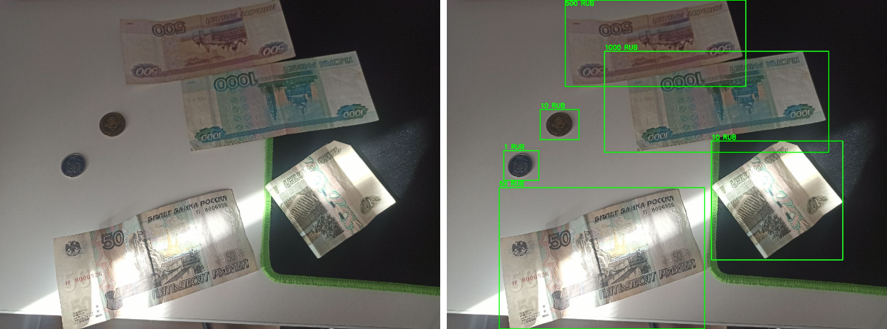
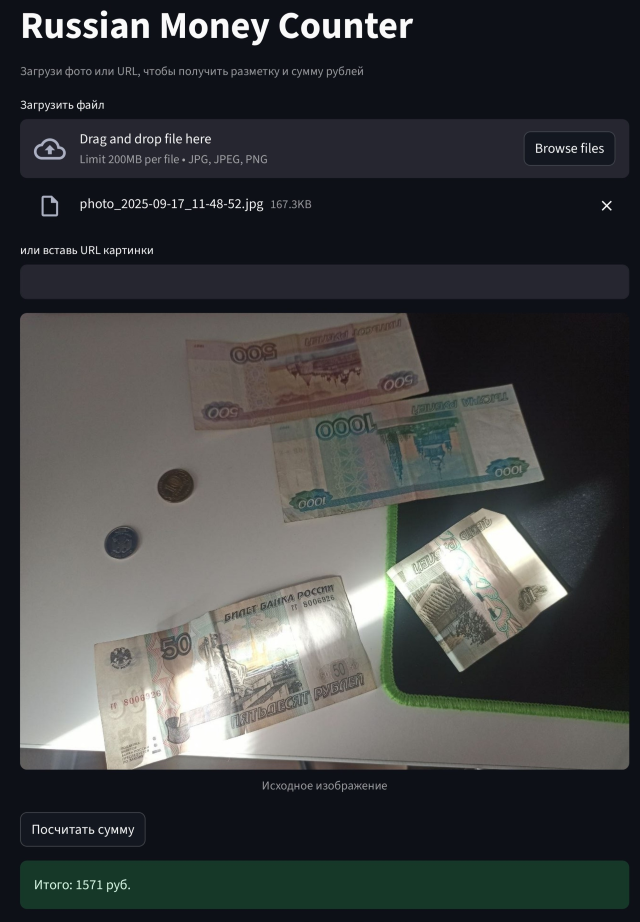

# RubleCounter — определение суммы денег по фото

Подсчёт суммы рублей (купюры и монеты) на изображении с помощью модели компьютерного зрения.

---

## Описание проекта

- Используется **YOLOv8** для детекции купюр и монет.
- Модель обучена на датасете изображений [купюр](https://universe.roboflow.com/rus-money/rus-money/dataset/2) и [монет](https://universe.roboflow.com/pachita/russian-ruble-coin/dataset/1).
- Результат работы: изображение с разметкой (`bounding boxes`) и итоговая сумма всех распознанных денег.

---

## Метрики модели

Оценка качества модели на валидационном наборе:

- **Precision(B):** `0.9833`  
- **Recall(B):** `0.9547`  
- **mAP@50(B):** `0.9845`  
- **mAP@50-95(B):** `0.8886`  

---

## Пример результата

